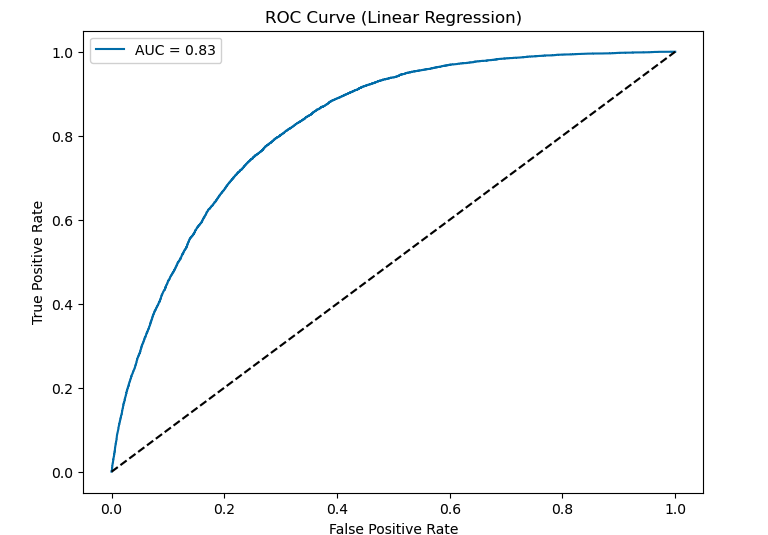

# Predictive Modeling for Diabetes
By: Ashley Blake and Rasha Abdalla

## Purpose: 
This project aims to develop a machine learning model to predict the likelihood of diabetes based on health indicators from the CDC (Centers for Disease Control and Prevention) dataset. By analyzing various health-related factors, we seek to build a predictive model that can assist healthcare professionals in identifying individuals at higher risk of developing diabetes.

## Introduction and Overview:
Diabetes affects  over 537 million people around the world , making it the deadliest and the most common non‐communicable disease.  According to the American Diabetes Association (ADA), in 2021, 38.4 million Americans, or 11.6% of the population, had diabetes. Additionally, 1.2 Million Americans are diagnosed with Diabetes every year. Early detection plays a pivotal role in managing and mitigating its adverse effects. By employing a robust predictor model, individuals at risk can be identified preemptively, allowing for timely interventions such as lifestyle modifications, dietary adjustments, or medical treatments. Moreover, such a model empowers healthcare providers to prioritize resources efficiently, streamline patient care, and allocate preventive measures to high-risk populations. Furthermore, from a societal perspective, the implementation of a diabetes predictor model can lead to substantial cost savings by reducing healthcare expenses associated with diabetes-related complications and improving overall health outcomes. Therefore, the development and deployment of a diabetes predictor model represent a proactive approach towards promoting public health, enhancing healthcare delivery, and ultimately, fostering a healthier and more resilient population.

## Dataset, Source and Exploration:
We utilized a clean dataset sourced from the UCI Machine Learning Repository, originally compiled from CDC health indicators. The dataset contained 253,680 rows (instances) and 21 columns (features), providing ample data for analysis. Given the dataset's cleanliness and organization, extensive analysis of statistical properties and visualization was not required. Instead, we focused on leveraging the existing dataset to identify pertinent variables for predictive modeling, streamlining the exploratory data analysis process.

* [UCI Machine Learning Repository] (https://archive.ics.uci.edu/dataset/891/cdc+diabetes+health+indicators)
* [Original CDC Dataset Link] (https://www.cdc.gov/brfss/annual_data/annual_2014.html)

## Model Development:
In the model development phase, we tested two different machine learning algorithms: logistic regression and decision tree. Each model underwent data preprocessing, including standardization and train-test splitting, before training and evaluation. 

## Results:
#### Logistic Regression:

##### Accuracy: Logistic regression achieved an accuracy of 86.59%, indicating that it correctly predicted the likelihood of diabetes in 86.59% of cases.
##### Precision and Recall: It showed a higher precision for the non-diabetic class (precision of 88%) compared to the diabetic class (precision of 55%), indicating that when it predicted an instance as non-diabetic, it was correct 88% of the time. However, the recall (true positive rate) for the diabetic class was low at 17%, indicating that it correctly identified only 17% of the actual diabetic cases.
##### ROC-AUC Score: The ROC-AUC score, which measures the model's ability to distinguish between positive and negative classes, was 0.826, suggesting a good performance.
##### Mean Squared Error and R-squared: The mean squared error (MSE) was 0.134, and the R-squared (R2) was -0.128, indicating that the model did not fit the data well and had limited predictive power.

#### Decision Tree:

 
##### Accuracy: The decision tree model achieved an accuracy of 79.86%, which is lower than logistic regression.
##### Precision and Recall: It showed balanced precision and recall scores for both classes, with precision and recall values around 0.30 to 0.34 for the diabetic class and 0.89 to 0.87 for the non-diabetic class.
##### Feature Importance: The decision tree model provided insights into feature importance, indicating which health indicators were most influential in predicting diabetes.
##### Interpretability: Decision trees are interpretable models, allowing for easy understanding of the decision-making process.

## References:

### Dataset

https://www.cdc.gov/brfss/annual_data/annual_2014.html

https://www.kaggle.com/datasets/alexteboul/diabetes-health-indicators-dataset

### (American Diabetes Association)

https://diabetes.org/about-diabetes/statistics/about-diabetes#:~:text=Overall%20numbers,of%20the%20population%2C%20had%20diabetes.&text=Diagnosed%20and%20undiagnosed%3A%20Of%20the,and%208.7%20million%20were%20undiagnosed.
