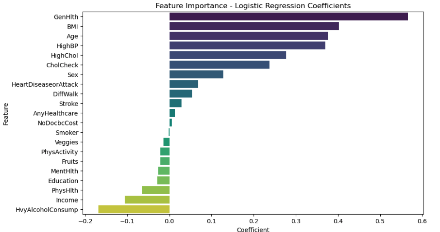

# Predictive Modeling for Diabetes
By: Ashley Blake and Rasha Abdalla

## Purpose: 
This project aims to develop a machine learning model to predict the likelihood of diabetes based on health indicators from the CDC (Centers for Disease Control and Prevention) dataset. By analyzing various health-related factors, we seek to build a predictive model that can assist healthcare professionals in identifying individuals at higher risk of developing diabetes.

## Introduction and Overview:
Diabetes affects  over 537 million people around the world , making it the deadliest and the most common non‐communicable disease.  According to the American Diabetes Association (ADA), in 2021, 38.4 million Americans, or 11.6% of the population, had diabetes. Additionally, 1.2 Million Americans are diagnosed with Diabetes every year. Early detection plays a pivotal role in managing and mitigating its adverse effects. By employing a robust predictor model, individuals at risk can be identified preemptively, allowing for timely interventions such as lifestyle modifications, dietary adjustments, or medical treatments. Moreover, such a model empowers healthcare providers to prioritize resources efficiently, streamline patient care, and allocate preventive measures to high-risk populations. Furthermore, from a societal perspective, the implementation of a diabetes predictor model can lead to substantial cost savings by reducing healthcare expenses associated with diabetes-related complications and improving overall health outcomes. Therefore, the development and deployment of a diabetes predictor model represent a proactive approach towards promoting public health, enhancing healthcare delivery, and ultimately, fostering a healthier and more resilient population.

## Dataset, Source and Exploration:
We utilized a clean dataset sourced from the UCI Machine Learning Repository, originally compiled from CDC health indicators. The dataset contained 253,680 rows (instances) and 21 columns (features), providing ample data for analysis. Given the dataset's cleanliness and organization, extensive analysis of statistical properties and visualization was not required. Instead, we focused on leveraging the existing dataset to identify pertinent variables for predictive modeling, streamlining the exploratory data analysis process.

* [UCI Machine Learning Repository] (https://archive.ics.uci.edu/dataset/891/cdc+diabetes+health+indicators)
* [Original CDC Dataset Link] (https://www.cdc.gov/brfss/annual_data/annual_2014.html)

## Model Development:
In the model development phase, we tested three different machine learning algorithms: logistic regression, decision tree, and random forest. Each model underwent data preprocessing, including standardization and train-test splitting, before training and evaluation. Logistic regression was chosen for its simplicity and interpretability, while the decision tree was selected for its ability to handle non-linear relationships. The random forest model was included for its ensemble learning capabilities, which can improve predictive performance by combining multiple decision trees. These models were evaluated based on accuracy, confusion matrix, classification report, and ROC-AUC score to determine their effectiveness in predicting diabetes

 

## Results:
#### Logistic Regression:

In the logistic regression model, we achieved an accuracy of 86.59%. The confusion matrix indicates that out of 50,736 instances, 42,775 were correctly classified as not having diabetes, while 1,157 were correctly classified as having diabetes. However, there were 5,840 false negatives and 964 false positives. The classification report shows a high precision of 0.88 for the negative class (no diabetes) but a lower precision of 0.55 for the positive class (diabetes). The recall is 0.98 for the negative class and 0.17 for the positive class, suggesting that the model is better at identifying non-diabetic cases. The ROC-AUC score of 0.83 indicates that the model performs reasonably well in distinguishing between the two classes. However, the mean squared error of 0.13 and the negative R-squared value suggest that the model may not be the best fit for the data, and further refinement or alternative models may be considered for improved performance.

                     

                                    Feature Importance 
                      
 

                                     ROC Curve    

 

                           Confusion Matrix 

#### Decision Tree:

In the decision tree model, we achieved an accuracy of 79.86%. The confusion matrix reveals that out of 50,736 instances, 38,172 were correctly classified as not having diabetes, while 2,345 were correctly classified as having diabetes. However, there were 4,652 false negatives and 5,567 false positives. The classification report shows a high precision of 0.89 for the negative class (no diabetes) but a lower precision of 0.30 for the positive class (diabetes). The recall is 0.87 for the negative class and 0.34 for the positive class, indicating that the model is better at identifying non-diabetic cases. The ROC-AUC score of 0.60 suggests that the model's ability to distinguish between the two classes is modest. 

                                        Decision Tree

                                                Feature Importance

                                                      ROC Curve

                          Confusion Matrix

#### Random Forest: 

In the random forest model, we achieved an accuracy of 85.98%. The confusion matrix reveals that out of 50,736 instances, 42,402 were correctly predicted as not having diabetes, while 1,219 were correctly predicted as having diabetes. However, there were 5,778 false negatives and 1,337 false positives. The classification report shows that the model has a high precision of 0.88 for the negative class (no diabetes) but a lower precision of 0.48 for the positive class (diabetes). The recall is 0.97 for the negative class and 0.17 for the positive class, indicating that the model is better at identifying non-diabetic cases. The ROC-AUC score of 0.80 suggests that the model performs reasonably well in distinguishing between the two classes. 

                     
                                                 Feature Importance

                                             Confusion Matrix

                                                    ROC Curve

 

## Conclusion:

In conclusion, our analysis of three different machine learning models for predicting diabetes yielded varying levels of performance. The logistic regression model exhibited the highest accuracy at 86.59%, with an ROC-AUC score of 82.64%. However, its performance in correctly identifying individuals with diabetes (precision and recall) was relatively low compared to other models. The decision tree model achieved an accuracy of 79.86% and a ROC-AUC score of 60.28%, indicating moderate predictive capability. On the other hand, the random forest model demonstrated an accuracy of 85.98%, with a slightly lower ROC-AUC score of 80.15%. Although random forest performed better than the decision tree, its precision and recall for identifying diabetes cases were also suboptimal. Overall, while logistic regression showed the highest overall accuracy, it may not be the most effective model for accurately identifying individuals with diabetes. Further refinement and exploration of alternative modeling techniques could enhance the predictive performance of the models and improve diabetes prediction accuracy.
